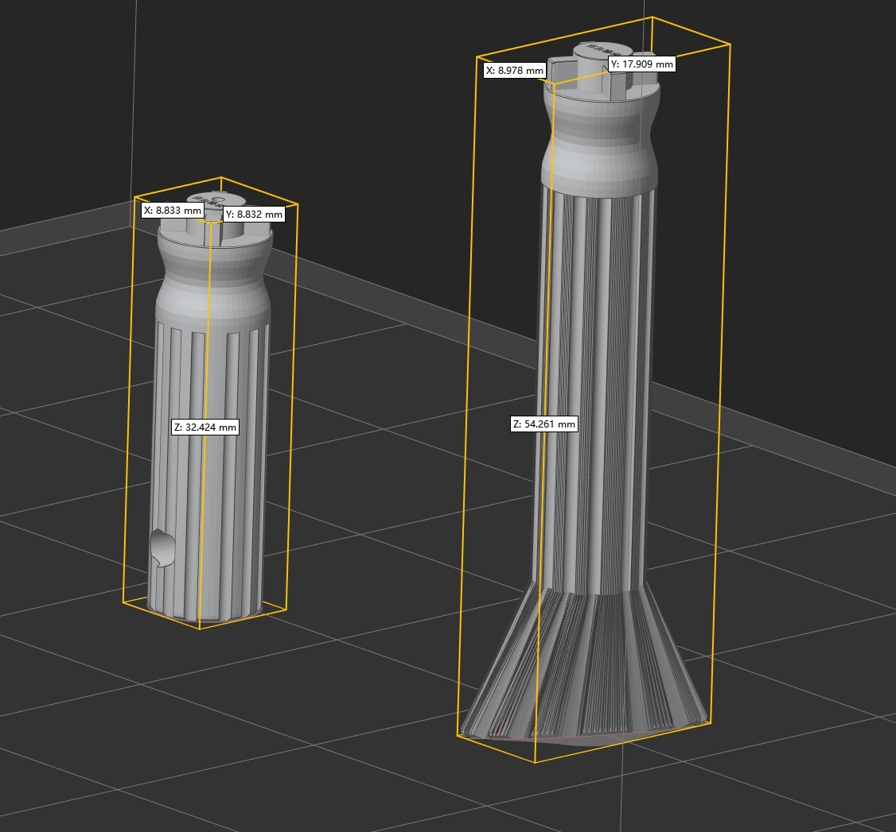

# 无头吉他调音器

 介绍
测试NK吉他可以正常使用,理论上十字口的无头琴桥应该都能通用，例如ibanez等等等,制作前建议自行校对开孔规格
适用于SLA/LCD/FDM类3D打印机,材料需要是高韧性耐磨材料，例如LCD用类ABS/类尼龙等材料效果更佳

 参考图片

# NK-headless-guitar-tuner

#### Introduction
Test NK guitars can be used, in theory, the headless bridge cross-mouth should be able to be used, such as Ibanez and so on, before the proposed self-calibration hole specifications
Suitable for SLA/LCD/FDM type 3D printers, materials need to be high-toughness wear-resistant materials, such as LCD ABS/nylon-like materials for better results

#### reference picture

